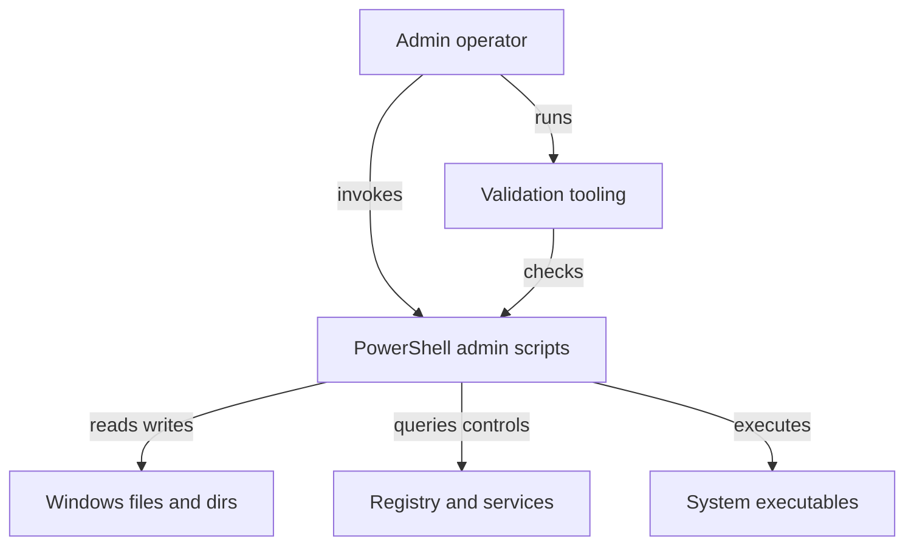

## Assumption-validation check-in

- Confirmed by user: the primary runtime is local or domain admin only, which matches the explicit admin-role checks and `#Requires -Version 5.1` execution model in the scripts.
- I assumed there is no direct internet-facing surface in this repo; the scripts look like endpoint-maintenance tooling rather than a server or agent with inbound network handlers.
- I assumed package staging for `C:\Install\Adobe\AcrobatInstaller.msi` is handled by an external deployment process that is not represented in this repo.
- I assumed the highest-value attacker is a local low-privilege user on the same endpoint, or a malicious package supplier affecting the Adobe installer path.
- I assumed `tests/`, `tools/`, and `Invoke-WhatIfValidation.ps1` are relevant to change control and regression risk, but not production runtime entry points.

Open questions that would materially change the rankings:

- Are the target endpoints shared with non-admin interactive users, or are they effectively single-admin machines?
- Is the Adobe MSI staging path controlled by a pinned software-distribution pipeline, or can admins place packages there manually?

User clarification received on March 28, 2026: these scripts are `local or domain admin only`. The report below treats remote or self-service non-admin invocation as out of scope and keeps focus on local host trust boundaries, package provenance, and operational ownership risk.

## Executive summary

The repo is a local admin-toolkit rather than a networked application, and the user confirmed it is intended for local or domain admin use only. That removes remote and self-service non-admin invocation from scope, so the top risks cluster around privileged file-system actions on the host, installer trust, and operator/maintainer concentration. The highest-risk areas remain the `CommonApplicationData` output/quarantine paths used by privileged scripts, the elevated Adobe installer workflow, and the fact that all security-sensitive code currently has bus factor 1 in git history.

## Scope and assumptions

In scope:

- Runtime script surfaces under `PowerShell Script/`
- Security-sensitive validation/change-control surfaces: `tests/`, `Invoke-WhatIfValidation.ps1`, and `tools/Invoke-PSScriptAnalyzer.ps1`

Out of scope:

- External deployment tooling that stages packages or invokes these scripts
- Windows OS internals beyond the explicit file/registry/service interactions used by the scripts
- Manual sandbox usage described in `docs/` and `sandbox/`, except as operational context

Assumptions:

- Scripts are run by trusted local or domain admins on local Windows endpoints, not by anonymous, remote, or self-service non-admin users.
- The repo does not implement authentication or authorization because it is not a service.
- The most realistic untrusted inputs are local filesystem state, registry state, staged installers, and prior on-disk directory creation.

Open questions:

- Whether endpoints are multi-user systems where low-privilege users can pre-stage `ProgramData` directories.
- Whether the Adobe package path is populated only by trusted automation.

## System model

### Primary components

- Admin operator: launches scripts from a local PowerShell session and decides whether to run preview (`-WhatIf`) or execute destructive actions.
- PowerShell admin scripts: privileged automation in `PowerShell Script/Adobe`, `PowerShell Script/Printer`, `PowerShell Script/windows-maintenance`, `PowerShell Script/WindowsServer`, and the remaining V7 companion under `PowerShell Script/V7/windows-maintenance`.
- Local Windows resources: filesystem locations such as `C:\Install`, `C:\Windows\Installer`, `C:\Windows\System32\spool\PRINTERS`, `ProgramData\sysadmin-main`, and per-user cache locations; registry hives such as `HKLM:\...\Uninstall` and `HKLM:\...\Installer\UserData`; services such as `Spooler` and `wuauserv`.
- Windows system executables: `msiexec.exe`, `netsh.exe`, `ipconfig.exe`, `shutdown.exe`, and `Dism.exe`.
- Validation/change-control tooling: `Invoke-WhatIfValidation.ps1`, `tests/`, and `tools/Invoke-PSScriptAnalyzer.ps1`.

Evidence anchors:

- `PowerShell Script/Adobe/Install.AdobeAcrobat.Clean.ps1` (`Invoke-AdobeAcrobatRefresh`)
- `PowerShell Script/windows-maintenance/Move-OrphanedInstallerFiles.ps1` (`Invoke-OrphanedInstallerMove`)
- `PowerShell Script/Printer/restart.SpoolDeleteQV4.ps1` (`Invoke-LoggedPrintQueueCleanup`)
- `PowerShell Script/windows-maintenance/Reset.Network.RebootPC.ps1` (`Invoke-NetworkReset`)
- `Invoke-WhatIfValidation.ps1`
- `tools/Invoke-PSScriptAnalyzer.ps1`

### Data flows and trust boundaries

- Admin operator -> PowerShell admin scripts
  - Data: invocation intent, `-WhatIf` preview, ambient environment variables, current user token
  - Channel: local PowerShell host / CLI
  - Security guarantees: privileged execution is gated by explicit admin-role checks in destructive flows; `SupportsShouldProcess` is widely enabled for previewability
  - Validation: most scripts have fixed parameters and derive paths internally; there is little free-form user input

- PowerShell admin scripts -> local filesystem
  - Data: staged MSI paths, quarantine copies, transcripts, CSV exports, temporary/cache files, spool files
  - Channel: PowerShell filesystem cmdlets and .NET path APIs
  - Security guarantees: many scripts constrain paths to expected roots and reject reparse points; some scripts apply restrictive ACLs to newly created output directories
  - Validation: `Test-PathWithinAllowedRoot`, `Resolve-SecureDirectory`, `Resolve-TrustedDirectoryPath`, and `Test-IsReparsePoint`

- PowerShell admin scripts -> Windows registry and services
  - Data: uninstall metadata, installer references, service state, queue state
  - Channel: `Get-ItemProperty`, `Get-ChildItem` on registry providers, `Get-Service` / `Stop-Service` / `Start-Service`
  - Security guarantees: HKLM scope and service control rely on local admin privilege; some scripts wait for service-state transitions and use fixed service names
  - Validation: registry roots and service names are hard-coded in the scripts, not user-supplied

- PowerShell admin scripts -> Windows system executables
  - Data: arguments for installer execution, network reset, reboot, and DISM cleanup
  - Channel: local process execution (`Start-Process`, call operator `&`)
  - Security guarantees: paths are built to `System32` executables and exit codes are checked
  - Validation: Adobe flow validates package signature before execution; network-reset and DISM paths are fixed

- Maintainer / reviewer -> validation tooling
  - Data: repo scripts, analyzer settings, Pester expectations, generated artifacts
  - Channel: local analyzer/test execution and artifact writes under `artifacts/validation`
  - Security guarantees: helps catch regressions, but does not directly enforce production-time policy
  - Validation: test suite is focused on `WhatIf`, hardening helpers, and helper tooling behavior

#### Diagram

## Assets and security objectives

| Asset | Why it matters | Security objective (C/I/A) |
| --- | --- | --- |
| Elevated admin execution context | These scripts can stop services, move installer files, clear caches, and reboot hosts | Integrity, Availability |
| Staged Adobe installer payload | A malicious or wrong installer would execute with admin privileges | Integrity |
| Quarantined MSI/MSP files | May contain reusable installers or patch payloads that should not leak to low-privilege users | Confidentiality, Integrity |
| ProgramData and LocalAppData logs/exports | Transcripts and CSV exports reveal operational state, printer ACLs, and maintenance activity | Confidentiality, Integrity |
| Windows service and network state | Spooler, update service, and network stack changes can break endpoint availability | Availability, Integrity |
| Validation tooling and analyzer settings | Weak validation increases the chance that future privileged-script regressions ship unnoticed | Integrity |

## Attacker model

### Capabilities

- Local low-privilege user on the same host who can influence filesystem state before an admin runs a script.
- Malicious package supplier or compromised staging workflow that can place a crafted MSI at `C:\Install\Adobe\AcrobatInstaller.msi`.
- Insider or maintainer who can modify the repo and rely on thin review/ownership coverage across sensitive scripts.

### Non-capabilities

- Anonymous internet attackers; this repo does not expose HTTP routes, sockets, or message consumers in the code under review, and the confirmed execution model is local or domain admin only.
- Attackers without local foothold or package-staging access; most threat paths require either local access or operator-assisted execution.
- Cross-tenant or multi-service abuse scenarios; this is not a multi-tenant service.

## Entry points and attack surfaces

| Surface | How reached | Trust boundary | Notes | Evidence (repo path / symbol) |
| --- | --- | --- | --- | --- |
| Script invocation | Local admin launches `.ps1` files | Admin operator -> PowerShell scripts | Main entry point for all runtime behavior | `PowerShell Script/*` |
| Adobe staged MSI | Fixed path `C:\Install\Adobe\AcrobatInstaller.msi` | Filesystem -> Adobe refresh script | Elevated install path gated by signature/publisher check | `PowerShell Script/Adobe/Install.AdobeAcrobat.Clean.ps1` / `Invoke-AdobeAcrobatRefresh` |
| Existing ProgramData output tree | Pre-existing `ProgramData\sysadmin-main\...` directories | Filesystem -> privileged scripts | Trusted if within root and not a reparse point; owner/DACL are not revalidated | `Resolve-SecureDirectory` in Adobe / printer transcript / orphan-move scripts |
| Installer registry state | HKLM uninstall and installer metadata | Registry -> Adobe and orphan-move scripts | Drives uninstall selection and orphan detection | `PowerShell Script/Adobe/Install.AdobeAcrobat.Clean.ps1`, `PowerShell Script/windows-maintenance/Move-OrphanedInstallerFiles.ps1` |
| Spool directory contents | `System32\spool\PRINTERS` files | Filesystem -> printer cleanup scripts | Files are deleted after spooler stop | `PowerShell Script/Printer/restart.SpoolDeleteQV4.ps1` |
| Cache/temp cleanup targets | LocalAppData, AppData, and Windows temp trees | Filesystem -> cleanup scripts | Fixed paths, reparse-point filtering, recursive delete | `PowerShell Script/windows-maintenance/Nettoyage.*.ps1` |
| Network reset commands | Fixed `netsh`, `ipconfig`, `shutdown` paths | Scripts -> system executables | Local only, destructive to connectivity | `PowerShell Script/windows-maintenance/Reset.Network.RebootPC.ps1` |
| Validation flows | Pester/analyzer/manual WhatIf execution | Maintainer -> validation tooling | Not runtime-facing, but security-relevant for regressions | `Invoke-WhatIfValidation.ps1`, `tests/`, `tools/Invoke-PSScriptAnalyzer.ps1` |

## Top abuse paths

1. Low-privilege local user creates `C:\ProgramData\sysadmin-main\Quarantine\InstallerOrphans` with weak ACLs -> admin runs orphan-move script -> privileged installer files are copied into an attacker-readable location.
2. Low-privilege local user creates `C:\ProgramData\sysadmin-main\Logs\AdobeAcrobat` or `...\Logs\Printer` with weak ACLs -> admin runs Adobe refresh or spooler cleanup -> attacker reads transcripts or installer logs to harvest operational data and package names.
3. Attacker or compromised staging pipeline places a malicious MSI at `C:\Install\Adobe\AcrobatInstaller.msi` with a valid but loosely matching `Adobe*` signer identity -> admin runs Adobe refresh -> arbitrary code executes with admin rights.
4. Admin runs cache cleanup or network reset on the wrong host or at the wrong time -> spooler, update, network, or cache state is disrupted -> endpoint availability degrades or active jobs are lost.
5. Single maintainer modifies a sensitive script or validation helper without effective peer review -> a regression in path trust, signer validation, or `WhatIf` safety lands unnoticed -> later admin execution broadens attack surface.

## Threat model table

| Threat ID | Threat source | Prerequisites | Threat action | Impact | Impacted assets | Existing controls (evidence) | Gaps | Recommended mitigations | Detection ideas | Likelihood | Impact severity | Priority |
| --- | --- | --- | --- | --- | --- | --- | --- | --- | --- | --- | --- | --- |
| TM-001 | Local low-privilege user on the same endpoint | Host is multi-user or otherwise allows non-admin precreation under `C:\ProgramData`; an admin later runs a privileged script | Pre-create `ProgramData\sysadmin-main\...` with weak ACLs, then wait for logs or quarantined files to be written there | Disclosure of privileged logs and installer payloads; possible trust confusion around future runs | ProgramData logs, quarantined installers, admin execution context | Path-root enforcement and reparse-point checks in `Resolve-SecureDirectory`; ACL hardening on newly created directories | Existing directories are trusted if they are not reparse points; owner/DACL are not revalidated | Harden and verify `$StorageRoot` itself; reject existing trees with unexpected owner/DACL; add tests for hostile precreated directories | Alert when `sysadmin-main` directories pre-exist before first trusted run; audit DACL drift; monitor unexpected file access to quarantine/log paths | medium | high | high |
| TM-002 | Malicious package supplier or compromised staging workflow | Attacker can replace the staged MSI and obtain a valid code-signing identity that passes `Adobe*` matching, or otherwise exploit loose signer matching | Supply a package whose signature is valid but whose publisher fields still satisfy the wildcard allowlist | Elevated arbitrary code execution during Adobe refresh | Admin execution context, endpoint integrity | Fixed package path, signature-status check, reparse-point rejection, `msiexec` fixed path | Trust decision is broader than necessary because it matches wildcarded simple name / subject / issuer text | Pin exact signer identities or certificate thumbprints; optionally require expected file hash from deployment pipeline | Log signer subject/thumbprint for every run; alert on signer changes; keep staged package hashes in deployment records | low to medium | high | high |
| TM-003 | Trusted operator error | Admin runs destructive script on the wrong endpoint, at the wrong time, or without understanding service/network side effects | Execute cleanup, spooler reset, or network reset in a context where the downtime is harmful | Local denial of service, lost print jobs, broken connectivity, or removed caches needed for troubleshooting | Service/network state, endpoint availability | `SupportsShouldProcess`, admin gating, fixed service names, fixed executable paths, exit-code checks, Windows Sandbox skip for network reset | No higher-level guardrail against wrong-host execution; scripts are intentionally destructive | Add optional confirmation banners with hostname/role; support explicit `-Confirm`/target metadata for the most disruptive scripts; document safe-use runbooks | Capture execution logs and host identity in transcripts/artifacts; monitor repeated spooler/network resets | medium | medium | medium |
| TM-004 | Single maintainer / review bottleneck | Current repo history remains thin and all sensitive code changes continue to flow through one person | Security-sensitive regressions land without enough review or ownership redundancy | Hardening drift, missed regressions, slower incident response | Sensitive admin scripts, analyzer settings, tests | Existing Pester and analyzer flows; ownership map artifacts now generated under `artifacts/validation/ownership-map-out` | Bus factor is 1 across all tagged sensitive categories; only 2 commits exist in history | Add at least one additional reviewer/maintainer for privileged scripts; make sensitive-script review mandatory; extend regression coverage for path trust and signer trust | Track reviewer coverage in PRs; periodically rerun ownership map and compare against CODEOWNERS or review policy | high | medium | medium |
| TM-005 | Already-privileged local attacker | Attacker can already alter HKLM uninstall entries, service state, or system directories | Shape uninstall metadata or filesystem state to influence admin script behavior | Limited incremental impact because the attacker is already privileged, but could still cause unintended tool execution or operational damage | Endpoint integrity, service state | Fixed registry roots, hard-coded service names, fixed system executable paths, `WhatIf` support | Some flows still trust local machine state as authoritative once admin context exists | Keep machine-state assumptions explicit; prefer signed/known binaries and exact allowlists where possible | Audit unexpected uninstall-string changes and unusual service-control activity | low | medium | low |

## Criticality calibration

For this repo and the assumptions above:

- `critical` means a non-admin or remote actor can reliably gain arbitrary code execution as admin/SYSTEM on managed endpoints, or can trigger destructive actions across many hosts without operator intervention.
  - Example: a remote self-service wrapper exposes these scripts to untrusted callers.
  - Example: a future regression allows arbitrary executable paths or package sources to run without trust checks.
- `high` means a realistic local or supply-chain actor can compromise privileged execution or gain access to privileged artifacts with limited preconditions.
  - Example: hostile precreation of `ProgramData\sysadmin-main` directories.
  - Example: malicious staged MSI accepted by the loose Adobe signer rule.
- `medium` means the issue mainly creates operator-driven outages or materially weakens the security maintenance process.
  - Example: wrong-host execution of destructive maintenance scripts.
  - Example: single-maintainer ownership over all sensitive code and validation paths.
- `low` means the issue requires existing privileged control or unusually strong preconditions, so it adds little incremental attacker leverage.
  - Example: shaping HKLM uninstall metadata after the attacker already has admin rights.
  - Example: manipulating service-control state when the attacker already controls the local machine.

## Focus paths for security review

| Path | Why it matters | Related Threat IDs |
| --- | --- | --- |
| `PowerShell Script/Adobe/Install.AdobeAcrobat.Clean.ps1` | Elevated installer path, signer validation, ProgramData log directory trust | TM-001, TM-002 |
| `PowerShell Script/windows-maintenance/Move-OrphanedInstallerFiles.ps1` | Moves privileged MSI/MSP files into ProgramData quarantine | TM-001 |
| `PowerShell Script/WindowsServer/FichierOphelin.ps1` | Duplicate orphan-installer workflow with the same quarantine trust boundary | TM-001 |
| `PowerShell Script/Printer/restart.SpoolDeleteQV4.ps1` | Stops spooler, deletes queue files, and writes privileged transcripts under ProgramData | TM-001, TM-003 |
| `PowerShell Script/windows-maintenance/Nettoyage.Avance.Windows.Sauf.logserreur.ps1` | Recursively deletes user/system caches and optionally runs DISM cleanup | TM-003 |
| `PowerShell Script/windows-maintenance/Nettoyage.Complet.Caches.Windows.ps1` | Stops update service, deletes update cache, flushes DNS, and clears recycle bin | TM-003 |
| `PowerShell Script/windows-maintenance/Reset.Network.RebootPC.ps1` | Executes network reset commands and forced reboot | TM-003 |
| `tests/Adobe/Install.AdobeAcrobat.Clean.Tests.ps1` | Good baseline coverage, but signer identity is not pinned in tests | TM-002, TM-004 |
| `tests/windows-maintenance/Move-OrphanedInstallerFiles.Tests.ps1` | Covers reparse points but not hostile precreated ProgramData trees | TM-001, TM-004 |
| `tools/Invoke-PSScriptAnalyzer.ps1` | Validation helper influences how security regressions are surfaced during maintenance | TM-004 |

## Quality check

- All discovered runtime entry points are covered at least once in the entry-point table.
- Each primary trust boundary appears in at least one threat or abuse path.
- Runtime scripts are separated from validation/change-control tooling.
- User clarifications were not available during this run; assumptions and open questions are explicit.
- Priority is most sensitive to whether these scripts are reachable by non-admin users and whether endpoints are shared with low-privilege users.
